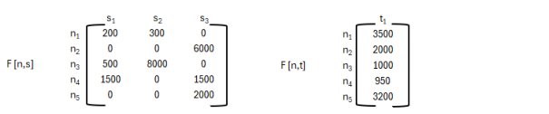
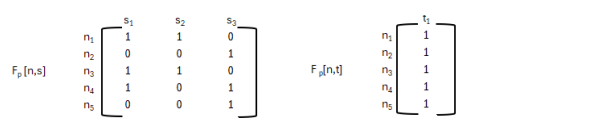

# Gestión de la agricultura de la precisión

La agricultura de la precisión considera la variabilidad espacial y temporal en los campos de cultivo, utiliza tecnologías avanzadas como GPS, GNSS, SIG, sensores, drones, imágenes saterlitales y máquinas inteligentes. 

El beneficio de utilizar el sistema de agricultura de precisión radica en recopilar información para gestionar zonas específicas, optimizando insumos, aumentando la sostenibilidad y rentabilidad de las actividades agrícolas. 

Se utilizarán los siguientes componentes tecnológicos: 

* __Sensores de suelo:__ Para medir la humedad del suelo, salinidad, conductividad eléctrica, nutrientes clave y PH.
* __Sensores de cultivo:__ Para evaluar el estado del cultivo a través de índices vegetales, estrés hídrico/térmico, cobertura, biomasa, y detección temprana de enfermedades.
* __Estaciones base agrometeorológicas:__ Para monitoriar condiciones atmosféricas en tiempo real así como temperatura, humedad relativa, radiación solar, etc.

El problema de diseño de distribución de estaciones base consiste en determinar la cantidad óptima de estaciones base necesarias para recolectar toda la información en tiempo real.

La metodología de agrupamiento propuesta consiste en identificar una matriz de frecuencias para __"n" estaciones base__ y __"s" sensores de suelo F[n,s]__ y otra matriz de frecuencia para las mismas __"n" estaciones base y "t" sensores de cultivo F[n,t]__ implimentados __en un campo agrícola "x"__ identificando de esta forma que estación base recibe datos de qué sensores de suelo y de cultivo.

El proceso de agrupamiento consiste en tranformar las matrices de frecuencias F[n,s] y F[n,t] en sus respectivas matrices de patrones F_p[n,s] y F_p[n,t] y agrupar las filas con el mismo patrón, de esta forma se obtiene el uso óptimo de estaciones base para transmitir toda la información recolectada en tiempo real hacia la plataforma en la nube.

Ejemplo para un campo de 5 estaciones base, 3 sensores de suelo y 1 sensor de cultivo 



Las matrices de patrones correspondientes serían



Se puede observar que lasd frecuencias para las estaciones n1 y n3; así como para las estaciones n2 y n5 tienen el mismo patrón tanto en Fp[n,s] como en Fp[n,t] por lo tanto podrán agruparse y optimizar el uso  de 5 estaciones base a 3 estaciones base. 


# Reportes
Se deberá utilizar la herramienta Graphviz para crear un grafo que muestre de manera gráfica las matrices de frecuencia F[n,s] y F[n,t], las matrices de patrones Fp[n,s] y  Fp[n,t] o las matrices reducidas Fr[n,s] y Fr[n,t] para cualquier campo agrícola configurado en la aplicación a desarrollar

## Ejemplo de Entrada

```
<?xml version="1.0"?>
<camposAgricolas>
 <campo id="01" nombre="Campo agrícola 01">
 <estacionesBase>
<estacion id="e01" nombre="Estacion 01"/>
 <estacion id="e02" nombre="Estacion 02"/>
 <estacion id="e03" nombre="Estacion 03"/>
 <estacion id="e04" nombre="Estacion 04"/>
 <estacion id="e05" nombre="Estacion 05"/>
 ...
 </estacionesBase>
 <sensoresSuelo>
 <sensorS id="s01" nombre="Sensor S01">
 <frecuencia idEstacion="e01"> 200 </frecuencia>
 <frecuencia idEstacion="e03"> 500 </frecuencia>
 <frecuencia idEstacion="e04"> 1500 </frecuencia>
 </sensorS>
 <sensorS id="s02" nombre="Sensor S02">
 <frecuencia idEstacion="e01"> 300 </frecuencia>
 <frecuencia idEstacion="e03"> 8000</frecuencia>
 </sensorS>
 <sensorS id="s03" nombre="Sensor S03">
<frecuencia idEstacion="e02"> 6000 </frecuencia>
<frecuencia idEstacion="e04"> 1500 </frecuencia>
<frecuencia idEstacion="e05"> 2000 </frecuencia>
 </sensorS>
 ...
 </sensoresSuelo>
 <sensoresCultivo>
 <sensorT id="t01" nombre="Sensor T01">
 <frecuencia idEstacion="e01"> 3500 </frecuencia>
 <frecuencia idEstacion="e02"> 2000 </frecuencia>
 <frecuencia idEstacion="e03"> 1000 </frecuencia>
 <frecuencia idEstacion="e04"> 950 </frecuencia>
 <frecuencia idEstacion="e05"> 3200 </frecuencia>
  </sensorT>
 ...
</sensoresCultivo>
 </campo>
</camposAgricolas>
``` 

# Ejemplo de Salida

```
<?xml version="1.0"?>
<camposAgricolas>
 <campo id="01" nombre="Campo agrícola 01">
 <estacionesBaseReducidas>
<estacion id="e01" nombre="Estacion 01, Estacion 03"/>
 <estacion id="e02" nombre="Estacion 02, Estacion 05"/>
 <estacion id="e04" nombre="Estacion 04"/>
 ...
 </estacionesBaseReducidas>
 <sensoresSuelo>
 <sensorS id="s01" nombre="Sensor S01">
 <frecuencia idEstacion="e01"> 700 </frecuencia>
 <frecuencia idEstacion="e04"> 1500 </frecuencia>
 </sensorS>
 <sensorS id="s02" nombre="Sensor S02">
 <frecuencia idEstacion="e01"> 8300 </frecuencia>
 </sensorS>
 <sensorS id="s03" nombre="Sensor S03">
 <frecuencia idEstacion="e02"> 8000 </frecuencia>
 <frecuencia idEstacion="e04"> 1500 </frecuencia>
 </sensorS>
 ...
 </sensoresSuelo>
 <sensoresCultivo>
 <sensorT id="t01" nombre="Sensor T01">
 <frecuencia idEstacion="e01"> 4500 </frecuencia>
 <frecuencia idEstacion="e02"> 5200 </frecuencia>
 <frecuencia idEstacion="e04"> 950 </frecuencia>
 </sensorT>
 ...
 </sensoresCultivo>
</campo>
...
</camposAgricolas>
```

La solución deberá contar con un menú en consola, con las siguientes opciones. 

* Cargar archivo
* Procesar archivo 
* Escribir archivo de salida
* Mostrar datos del estudiante
* Generar gráfica
* Salida

__1.Cargar archivo__: Esa opición solicitará la ruta y el nombre del archivo a cargar

Opción Cargar archivo:
* Ingrese la ruta del archivo
* Ingrese el nombre del archivo

__2.Procesar el archivo__: Esta opción será la encargada de procesar la información cargada en memoria, durante el proceso se deben ir mostrando mensajes al usuario para tener el conocimiento de lo que está pasando en el sistema
* Cargando campo agrícola 01
* Creando estación base 01

__3.Escribir Archivo de salida__: Esta opción será la encarga de escribir el archivo con la salida específica. 
* Ingrese la ruta del archivo
* Ingrese el nombre del archivo

__4.Mostrar datos del estudiante__: Mostrar los datos del estudiante, carné, nombre, curso, semestre y enlace de acceso a documentación

__5.Generar gráfica__: El programa deberá permitir que el usuario elija un campo agrícola ingresado en el archivo de entrada, luego debe solicitar si se desea graficar la matriz de frecuencia, la matriz de patrones o la matriz reducia de dicho campop agrícola.


